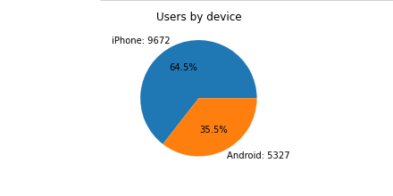
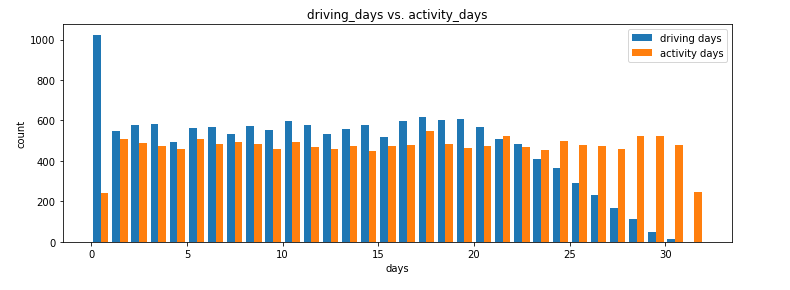
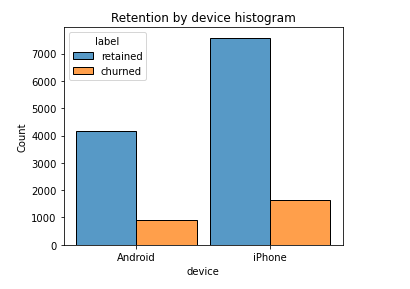
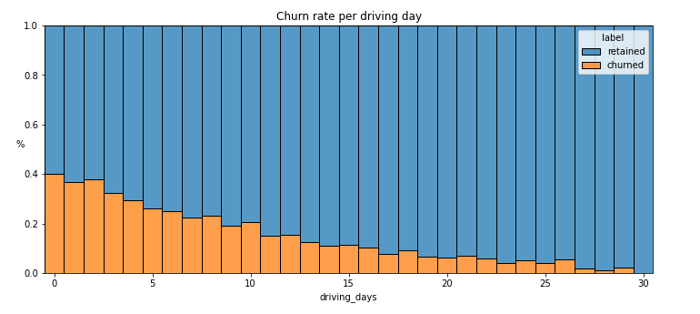

# User-churn-prediction

Waze’s free navigation app makes it easier for drivers around the world to get to where they want to go. Waze’s community of map editors, beta testers, translators, partners, and users helps make each drive better and safer. Waze partners with cities, transportation authorities, broadcasters, businesses, and first responders to help as many people as possible travel more efficiently and safely. 

This project is part of a larger effort at Waze to increase growth. Typically, high retention rates indicate satisfied users who repeatedly use the Waze app over time. Developing a churn prediction model will help prevent churn, improve user retention, and grow Waze’s business. An accurate model can also help identify specific factors that contribute to churn.

**Overview**

The goal of this project was to build a machine-learning model to predict user churn. Churn quantifies the number of users who have uninstalled the Waze app or stopped using the app. This project focuses on monthly user churn. Two tree-based models were built and tested, the random forest model and XGBoost. The purpose of this model is to find factors that drive user churn. The goal of this model is to predict whether or not a Waze user is retained or churned. The final champion model XGBoost was performed with 71% accuracy and 50% recall. Based on the model, the km_per_hour, n_days_after_onboarding, percent_sessions_in_last_month, and total_sessions_per_day were most influential in determining a retain user vs churn user. 

**Business Understanding**

This work will help leadership make informed business decisions to prevent user churn, improve user retention, and grow Waze’s business. Waze will take proactive measures to retain users who are likely to stop using the app. For example, if Waze can identify a segment of users who are at high risk of churning, Waze can proactively engage these users with special offers to try and retain them.

**Data Understanding**

The data consisted of 14999 entries and 13 features. The features included information on the number of occurrences of a user opening the app during the month, the type of device a user starts a session with, the number of days since a user signed up for the app, total kilometers driven during the month, and number of days the user opens the app during the month. The pie chart below shows the number of users by device. 

There are nearly twice as many iPhone users as Android users represented in this data.

A histogram that, for each day, has a bar representing the counts of driving_days and activity_days. 

A histogram that has four bars—one for each device-label combination—to show how many iPhone users were retained/churned and how many Android users were retained/churned.

Another histogram represents the churn rate for each number of driving days.

**Modeling and Evaluation**

An XGBoost model comprising 400 decision trees was used to determine feature importance in who would churn. The plot below shows the top 4 most important factors in determining a generous tipper from a non-generous one. The overall model performed with 86% accuracy and 72% precision. 

**Conclusion**

This model can benefit Taxi Drivers in knowing if they will be tipped generously; however, running a parametric model to determine how much each variable will influence the actual price of the tip. In the future, adding more information on a rider’s past tipping behavior may also be beneficial in helping the stakeholder address their business problem. 

Waze’s free navigation app makes it easier for drivers around the world to get to where they want to go. Waze’s community of map editors, beta testers, translators, partners, and users helps make each drive better and safer. Waze partners with cities, transportation authorities, broadcasters, businesses, and first responders to help as many people as possible travel more efficiently and safely. 

I’ll collaborate with my Waze teammates to analyze and interpret data, generate valuable insights, and help leadership make informed business decisions. My team is about to start a new project to help prevent user churn on the Waze app. Churn quantifies the number of users who have uninstalled the Waze app or stopped using the app. This project focuses on monthly user churn. 

This project is part of a larger effort at Waze to increase growth. Typically, high retention rates indicate satisfied users who repeatedly use the Waze app over time. Developing a churn prediction model will help prevent churn, improve user retention, and grow Waze’s business. An accurate model can also help identify specific factors that contribute to churn and answer questions such as: 

  - Who are the users most likely to churn?

  - Why do users churn? 

  - When do users churn? 

For example, if Waze can identify a segment of users who are at high risk of churning, Waze can proactively engage these users with special offers to try and retain them. Otherwise, Waze may lose these users without knowing why. 

Attached:
 - PACE Strategy Document to plan the project that considers the audience members, teammates, key milestones, and overall project goal. The PAC Strategy Document
   * Is relevant to the project goals and related to data science.
   * Demonstrates our understanding and assessment of the business scenario.
   * Communicates the reasoning behind our decisions to pair PACE stages with specific tasks.
     
 - Project proposal for the data team. The project proposal
   * Clearly communicate the overall project goal 
   * Identify key tasks, milestones, and stakeholders
     
 - Python notebooks for each stage of the PACE strategy.

 - Executive summary which will keep our teammates at Automatidata informed of our progress. 
    
**Note**: The story, all names, characters, and incidents portrayed in this project are fictitious. No identification with actual persons (living or deceased) is intended or should be inferred. And, the data shared in this project has been created for pedagogical purposes. 
